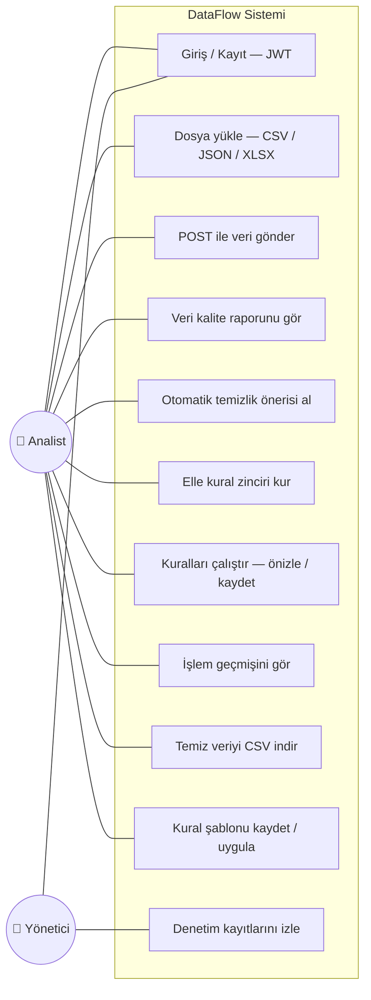
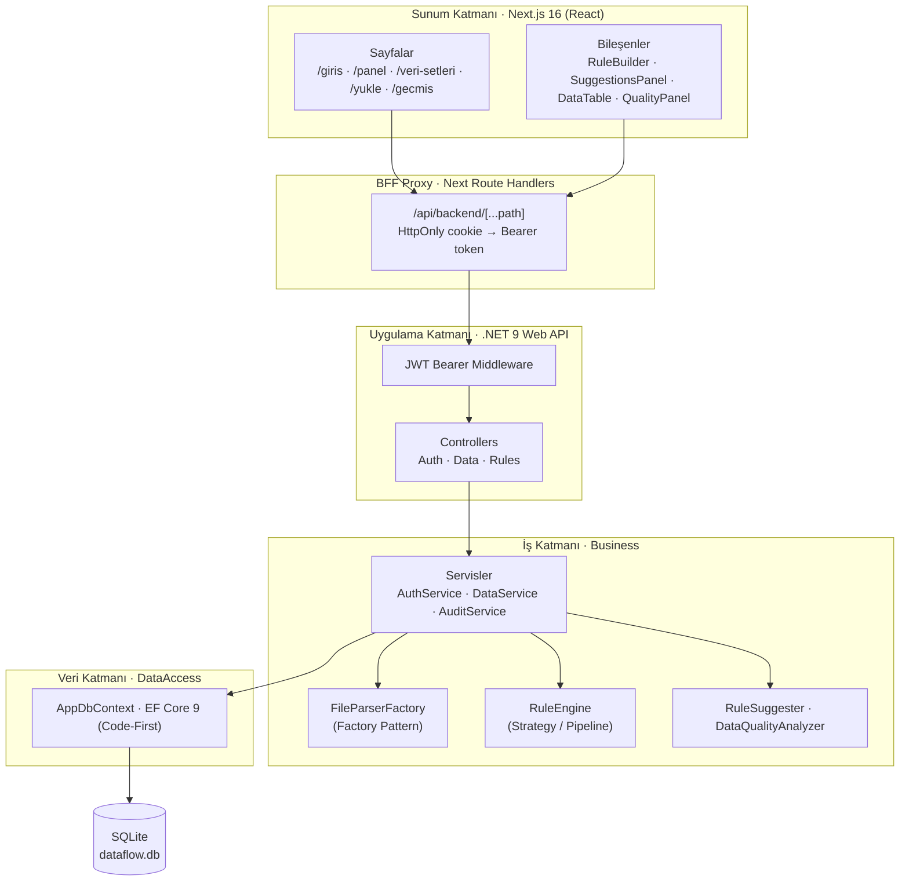
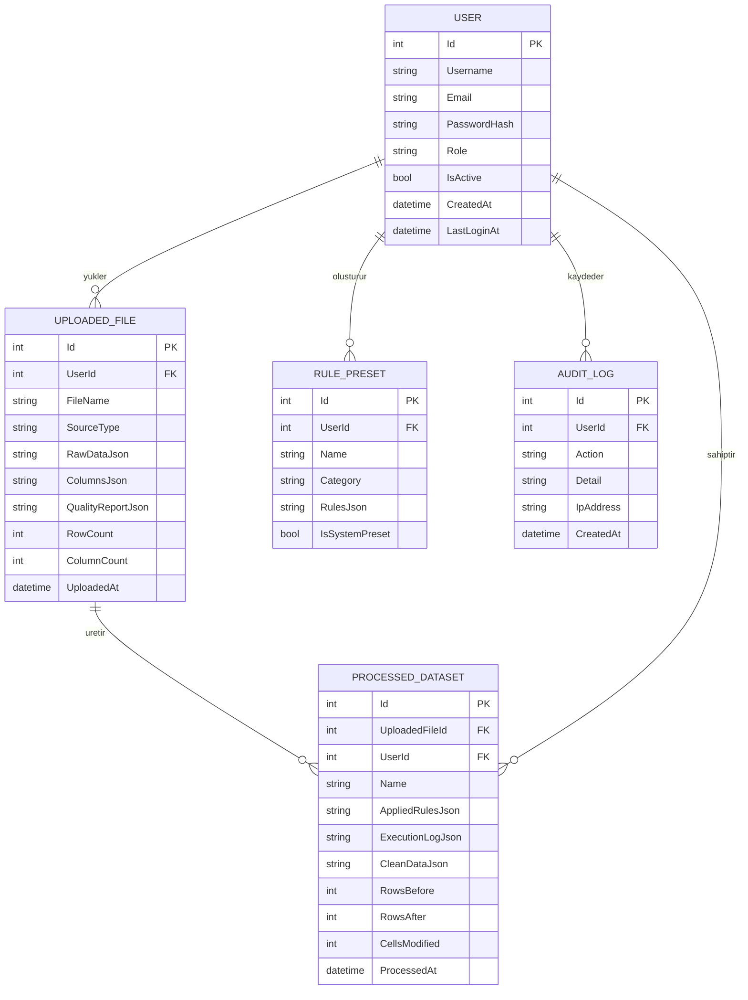
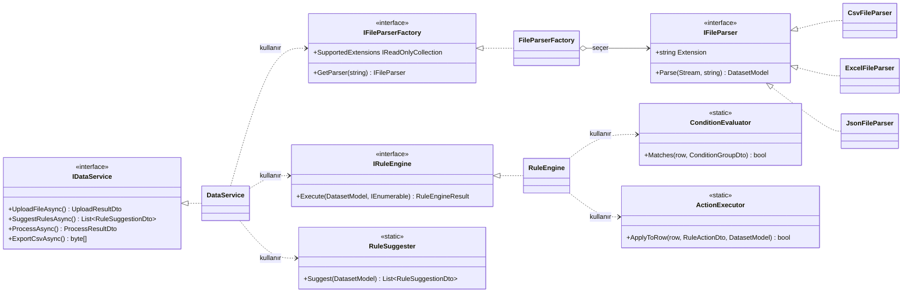
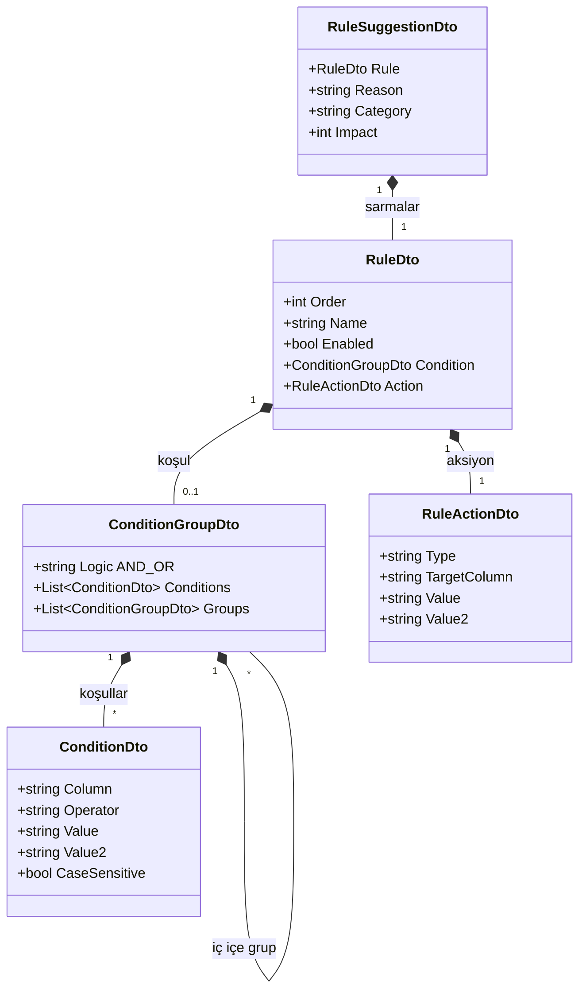
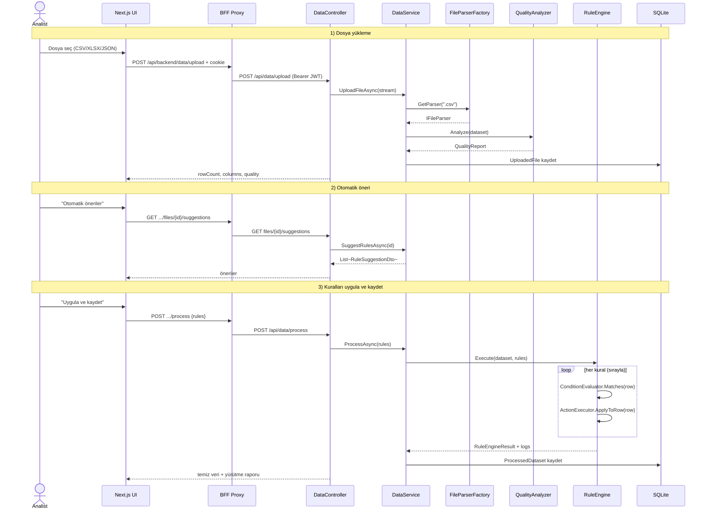

# DataFlow — UML Diyagramları

Bu diyagramlar koddaki gerçek sınıf, arayüz ve uç noktalarla birebir uyumludur.
GitHub bu `mermaid` bloklarını otomatik render eder.

---

## 1. Use-Case Diyagramı

---

## 2. Katmanlı Mimari / Bileşen Diyagramı

---

## 3. Varlık-İlişki (ER) Diyagramı — Veritabanı

---

## 4. Sınıf Diyagramı — Servisler ve Tasarım Kalıpları

---

## 5. Sınıf Diyagramı — Kural Modeli (DTO Kompozisyonu)

Kural motorunun kalbi: bir kural, iç içe koşul grupları ve tek bir aksiyondan oluşur.

> **Operatörler (20):** eq, neq, gt, gte, lt, lte, between, contains, notContains,
> startsWith, endsWith, isNull, isNotNull, isEmpty, isNotEmpty, in, notIn, regex,
> isNumeric, isNotNumeric
>
> **Aksiyonlar (25):** deleteRow, keepRow, flagRow, setValue, fillNull, trim,
> toUpper, toLower, toTitleCase, replace, removeSpaces, onlyDigits, multiply,
> divide, add, subtract, round, abs, castNumber, castDate, castText,
> renameColumn, dropColumn, copyColumn, deduplicate

---

## 6. Sekans Diyagramı — Yükleme + Otomatik Temizleme Akışı

